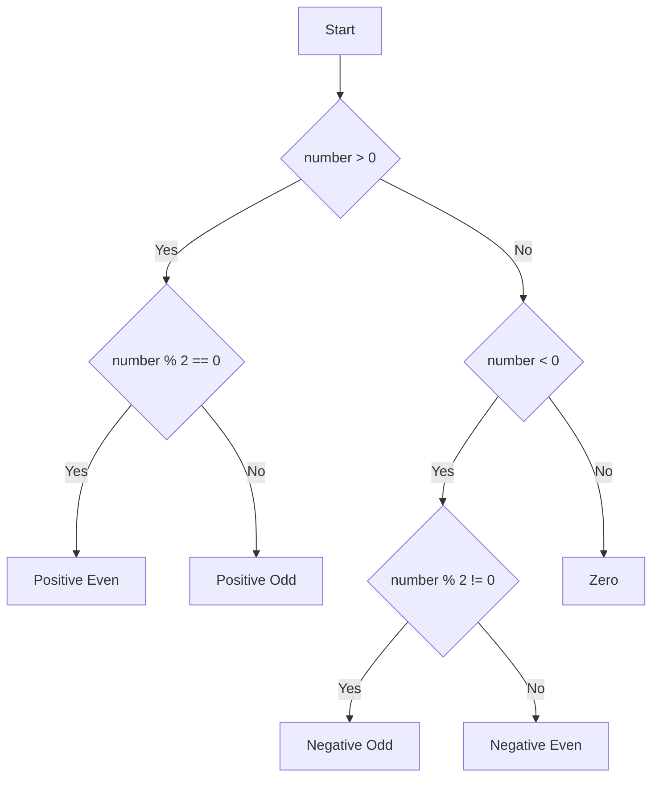
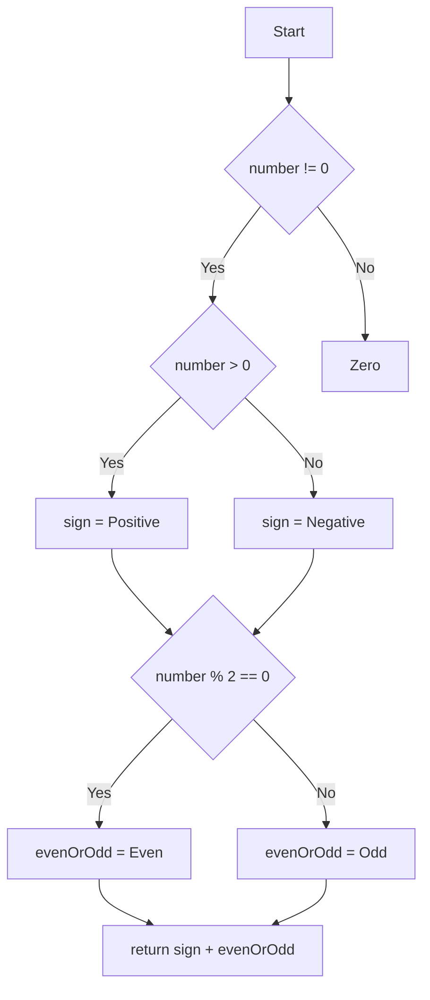

# Bevezetés

Kérdések:
- Mi az a white box tesztelés?
- Milyen különbségek vannak a black box és grey box testinghez képest?

# Főbb fogalmak

 A white box főbb jellemzői:
  - A belső működés ismeretén alapuló tesztelés
  - Alacsonyabb szinten történő tesztelés
  - Konkrét implementáció függő
  - Egy teszt kicsi és gyorsan lefut
  - Unit teszt, Integrációs teszt

Statikus kódelemzés:
  -  a forráskód automatikus vizsgálatát jelenti anélkül, hogy a programot futtatnánk

CI:
  - A feljesztett kód egy közös repositoryba való feltöltése
  - automatikus build és teszt futtatást biztosító eszköz
  - háttérben fut és hiba esetén értesítést küld
  - fejlesztési fázisban gyors visszacsatolást tud adni a feltárt hibákról

# Eszközök bemutatása

1. Csatlakozás a Github classroom-ba
2. Github kódelemzés repository bemutatása: Java és spock
3. Github actions ci workflow bemutatása
4. Sonarcloud regisztráció

# Kódhibák megtalálása statikus kódelemzés segítségével

Issue típusok:
- Bug: Hibák, amelyek a program helytelen működését okozhatják.
- Vulnerability: Biztonsági rések, amelyek kihasználhatók lehetnek.
- Code smell: Olyan kódrészletek, amelyek nem feltétlenül hibásak, de a kód minőségét rontják és nehezítik a karbantartást.

Célok:
- korai fázisban a kódolási hibák eliminálása
- kódminőség fenntartása
 
Feladat #1: 
- Nézzük meg a konkrét sonar issuekat
- Calculator javítása sonar issuek eltüntetése céljából
  
# Kódhibák megtalálása unit teszekkel

Alapfogalmak:
- Konkrét implementációhoz kapcsolódik.
- Hozzájárul a teszt lefedettésgi mutatóhoz.

Célok:
  - korai fázisban a futási/logikai hibák eliminálása

Feladat #2: 
- nezzük meg a tesztelefedettséget a Calculator esetén
- kódhibák javítása újabb unit tesztek definiálásával különös figyelemmel az edge case-ekre
- hogy alakult a teszt lefedettség?

# Lefedettség összetettebb kód esetén

Alapfogalmak:
- Komplexitás
  - Ciklomatikus: a kód logikai összetettségét mutatja, az elágazások számát méri
  - Kognitív: indikátor arra vonatkozólag, hogy mennyire nehéz a kód megértése
- Coverage
  - Statement coverage: Méri, hogy minden végrehajtható utasítás végre lett-e hajtva a kódban.
  - Branch coverage: Méri, hogy minden elágazás (true/false) végre lett-e hajtva a vezérlési szerkezetekben (pl. if-else, switch-case).
  - Path coverage: Méri, hogy minden lehetséges útvonal végre lett-e hajtva a kódban, figyelembe véve az összes elágazás kombinációját.
- Komplexitás és a coverage közötti kapcsolat:
  - branch coverage ≤ cyclomatic complexity ≤ number of paths.

**Branch coverage példa:**

**Path coverage példa:**

Feladat #3: A NumberClassifier implementációk összevetése
- Komplexitás összehasonlítása
- További tesztek készítése a NumberClassifierSpec-ben a 100% coverage eléréséhez
- A két NumberClassifier ugyanazt csinálja, lefedhetőek ugyanazokkal a tesztekkel?

# Összegzés

- A white box tesztelés kiváltja a többi tesztelési fajtát?
  - Statikus hibáktól mentes kód 100%-os teszt lefedettség mellett működhet-e rosszul?

